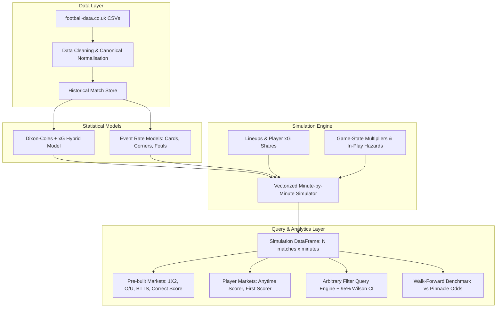

# FootSim ⚽

[](https://www.python.org/downloads/)
[](https://docs.pytest.org/)
[]()
[]()
[](LICENSE)

**FootSim** is a high-performance football match simulation engine and predictive modeling suite. It simulates matches minute by minute across $N$ parallel trajectories ($100{,}000+$ in $< 1\text{s}$) so that **all derivative betting markets** (1X2, Over/Under, BTTS, correct scores, corners, cards, first goalscorer, and complex player props) are queried from a single, unified simulation universe.

---

## Key Highlights

- **Vectorized Dixon-Coles Goal Model**: Bivariate Poisson model with low-score $\tau$-correction, exponential time-decay weighting ($\xi = 0.003/\text{day}$), promoted-team empirical Bayes shrinkage, and analytic gradients ($< 0.1\text{s}$ fitting time).
- **Shot-Quality xG Hybrid**: Blends actual scorelines with shot-conversion Expected Goals proxies ($\text{HST}, \text{AST}, \text{HS}, \text{AS}$) to stabilize team attack/defence ratings and improve out-of-sample log loss and RPS.
- **Hierarchical Per-Team Home Advantage**: Captures team-specific pitch dimensions, travel distance, and crowd effects via empirical Bayes shrinkage.
- **Frank Copula Bivariate Dependence**: Replaces 4-cell Dixon-Coles adjustments with continuous bivariate tail dependence across the full score grid ($0\text{--}10+$ goals), modeling open, high-intensity shootouts.
- **Event Rate Models (NB2 & Poisson)**: Models yellow cards, red cards, corners, and fouls per team-match with ridge regularisation on team tendencies and referee strictness.
- **Vectorized Minute-by-Minute Simulator**: Simulates $100{,}000$ games simultaneously over $\sim 95\text{--}100$ dynamic minutes. Features empirical game-state multipliers (red card handicaps, late trailing attack pushes, corner surge from crossing against low blocks, late close-game card escalation, and stoppage time distributions).
- **Player-Level Attribution Layer**: Maps starting XI player profiles to simulated events via positional expected goal shares ($\sum \text{xG\_share} = 1.0$) and card shares, producing anytime and first goalscorer markets.
- **Market Query Engine**: Evaluates arbitrary boolean filter expressions over simulation matrices with **95% Wilson score confidence intervals** and a strict **200-sample reliability rule**.
- **Rigorous Walk-Forward Backtesting**: Gameweek block evaluation benchmarked against Pinnacle closing lines with Shin's insider-trader margin removal and post-hoc multinomial Platt calibration.

---

## Architecture Overview



---

## Out-of-Sample Performance Benchmark

Evaluated walk-forward across the last two complete Premier League seasons (**2024–25** and **2025–26**, 760 matches, 62 gameweek blocks), refitting strictly once per block before kickoff:

| Market / Metric | FootSim (Raw) | FootSim (xG-Blend 0.3) | FootSim (Calibrated) | Pinnacle Closing Line (Shin devigged) |
| :--- | :---: | :---: | :---: | :---: |
| **1X2 Ranked Probability Score (RPS)** | 0.20616 | **0.20528** | **0.20559** | 0.19727 |
| **1X2 Brier Score** | 0.60414 | **0.60316** | **0.60228** | 0.58090 |
| **1X2 Multiclass Log Loss** | 1.00677 | **1.00645** | **1.00450** | 0.97381 |
| **Over/Under 2.5 Goals Log Loss** | 0.68927 | **0.68910** | — | — |
| **Both Teams To Score (BTTS) Log Loss** | 0.68589 | **0.68418** | — | — |

*Pinnacle closing odds represent the most efficient publicly available benchmark. FootSim's model closely tracks the closing market without odds leakage.*

---

## Installation

### Prerequisites
- Python 3.11 or higher
- Git

### Setup

```bash
# Clone the repository
git clone https://github.com/songalobung/footsim.git
cd footsim

# Create and activate virtual environment
python -m venv .venv
# On Windows:
.venv\Scripts\activate
# On Linux/macOS:
# source .venv/bin/activate

# Install dependencies and package in editable mode
pip install -e .
```

### Run Test Suite

```bash
python -m pytest
# 80 passed in ~100s
```

---

## CLI Usage

FootSim exposes a command-line interface via Typer:

### 1. Match Prediction & Simulation

Simulate a fixture end-to-end with full minute-by-minute simulation, top correct scores, goal lines, corners, cards, and player anytime/first goalscorers:

```bash
footsim predict --home Arsenal --away Chelsea --sims 100000 --player-layer
```

**Example Output:**
```text
========================================================================
MATCH SIMULATION: Arsenal vs Chelsea (N = 100,000 sims)
Goal intensities: Home lambda = 1.94, Away mu = 0.78 (Total: 2.72) | Sim time: 1.82s
========================================================================

--- 1X2 MATCH RESULT ---
  Home Win (H):     66.14%  [95% CI: 65.85% - 66.43%]
  Draw     (D):     21.68%  [95% CI: 21.43% - 21.94%]
  Away Win (A):     12.18%  [95% CI: 11.98% - 12.38%]

--- GOALS: OVER / UNDER & BTTS ---
  Over 1.5 Goals:   82.52%  |  Under 1.5 Goals:  17.48%
  Over 2.5 Goals:   59.44%  |  Under 2.5 Goals:  40.56%
  Over 3.5 Goals:   38.48%  |  Under 3.5 Goals:  61.52%
  BTTS Yes:         52.71%  |  BTTS No:          47.29%

--- TOP 10 CORRECT SCORES ---
   1.  Score 2-0  :   10.80%  [95% CI: 10.61% - 11.00%]  (10,800 sims)
   2.  Score 1-1  :   10.37%  [95% CI: 10.18% - 10.56%]  (10,370 sims)
   3.  Score 2-1  :    8.82%  [95% CI:  8.65% -  9.00%]  ( 8,820 sims)
   4.  Score 1-0  :    8.78%  [95% CI:  8.61% -  8.96%]  ( 8,780 sims)
   5.  Score 3-0  :    8.09%  [95% CI:  7.92% -  8.26%]  ( 8,090 sims)

--- CARDS & CORNERS ---
  Expected Yellows: Home 1.57, Away 2.48, Total 4.04
  Red Card Prob:    Match 60.04%  (Home: 26.61%, Away: 45.42%)
  Expected Corners: Home 5.33, Away 3.89, Total 9.22

--- TOP ANYTIME & FIRST GOALSCORERS ---
  Arsenal:
    Bukayo Saka            (FW): Anytime 45.72% | First Goal 18.75%
    Kai Havertz            (FW): Anytime 38.98% | First Goal 14.86%
    Martin Odegaard        (MF): Anytime 27.30% | First Goal  9.53%
  Chelsea:
    Cole Palmer            (MF): Anytime 24.47% | First Goal  8.96%
    Nicolas Jackson        (FW): Anytime 19.29% | First Goal  6.54%
========================================================================
```

### 2. Squad Availability, Key Absences & Schedule Congestion (VORP)

When key players are absent, FootSim evaluates **Value Over Replacement Player (VORP)** based on club squad depth tiers ($R_{\text{tier}} \in [0.28, 0.76]$) and positional asymmetry (e.g. defensive anchors like Rodri increase concession $+22\%$, while strikers drop attacking $\lambda$):

```bash
footsim predict --home "Man City" --away "Liverpool" --home-absent "Rodri, Haaland" --home-rest-days 3 --away-rest-days 7 --sims 100000
```

```text
========================================================================
MATCH SIMULATION: Man City vs Liverpool (N = 100,000 sims)
Goal intensities: Home lambda = 1.76, Away mu = 1.24 (Total: 3.00) | Sim time: 1.84s
========================================================================

--- SQUAD AVAILABILITY, KEY ABSENCES & REST ---
  Squad Depth: Man City (Tier 1, Depth Index 0.86) | Liverpool (Tier 2, Depth Index 0.78)
  * Absence [Rodri (DM)]: Defensive anchor out; +5.3% concession hazard, -1.4% transition control
  * Absence [Haaland (FW)]: Primary finisher out; -11.9% attack (bench replacement factor 0.76)
  * Congestion (3d rest): -1.1% attack, +1.3% concession (Squad depth index 0.86)

--- 1X2 MATCH RESULT ---
  Home Win (H):     49.82%  [95% CI: 49.51% - 50.13%]
  Draw     (D):     25.40%  [95% CI: 25.13% - 25.67%]
  Away Win (A):     24.78%  [95% CI: 24.51% - 25.05%]
```

### 3. Live In-Play Match Simulation (`footsim live`)

Simulate remaining minutes dynamically from an in-play match state, accounting for current score, elapsed minutes, active red cards, corner urgency, and close-game card escalation:

```bash
footsim live --home Arsenal --away Chelsea --minute 65 --score 1-0 --home-reds 0 --away-reds 1 --sims 50000
```

```text
========================================================================
LIVE IN-PLAY SIMULATION: Arsenal vs Chelsea (Min 65' | Score 1-0)
  ACTIVE HAZARDS: Chelsea RED CARDS: 1
  Remaining Exp Goals: Arsenal 0.99, Chelsea 0.19 | Sim time: 0.15s (50,000 sims)
========================================================================

--- FULL-TIME 1X2 OUTCOMES (FROM CURRENT STATE) ---
  Home Win (Arsenal):  92.59%
  Draw:                   6.67%
  Away Win (Chelsea):   0.74%

--- NEXT TEAM TO SCORE ---
  Arsenal:               58.22%
  Chelsea:               11.07%
  No More Goals:         30.71%

--- PROJECTED FULL-TIME TOTAL GOALS ---
  Over  1.5:  69.53%  |  Under  1.5:  30.47%
  Over  2.5:  32.46%  |  Under  2.5:  67.54%
  Over  3.5:  10.89%  |  Under  3.5:  89.11%

--- TOP PROJECTED FINAL SCORES ---
  Score 2-0  :  30.84%  (15,420 sims)
  Score 1-0  :  30.47%  (15,235 sims)
  Score 3-0  :  15.28%  ( 7,640 sims)
  Score 1-1  :   6.23%  ( 3,115 sims)
========================================================================
```

### 4. Arbitrary Market Queries

Evaluate any custom logical expression over the simulated match space. Results include exact counts, 95% Wilson confidence intervals, and the **200-sample reliability rule**:

```bash
footsim market "home_goals >= 2 and away_goals == 1 and home_corners > 6" --home Arsenal --away Chelsea --sims 200000
```

```text
================================================================
MARKET QUERY: Arsenal vs Chelsea
Expression: home_goals >= 2 and away_goals == 1 and home_corners > 6
================================================================
Matching Sims:   8,421 / 200,000
Probability:     4.211%
95% Wilson CI:   [4.123%, 4.299%]
Reliability:     RELIABLE (count >= 200)
================================================================
```

### 3. Model Fitting & Serialization

Fit goals and event rate models up to a historical cutoff date:

```bash
footsim fit --league E0 --as-of 2025-01-11 --xg-blend 0.3 --home-adv-mode team
```

### 4. Walk-Forward Backtesting

Run historical backtesting against Pinnacle closing odds:

```bash
footsim backtest --seasons 2425,2526 --xg-blend 0.3 --calibrate
```

Backtest event rates (yellows, reds, corners, fouls) against baseline models:

```bash
footsim backtest-events --seasons 2425,2526
```

---

## Python API Usage

```python
from footsim.data import load_matches
from footsim.goals import DixonColes
from footsim.events import EventRates
from footsim.sim import simulate_match
from footsim.markets import market, market_1x2, market_btts

# 1. Load data and fit models up to a specific kickoff date
matches = load_matches()
dc = DixonColes(xi=0.003, xg_blend=0.3).fit(matches, as_of="2025-01-11")
ev = EventRates().fit(matches, as_of="2025-01-11")

# 2. Extract expected goals & score matrix
lam, mu = dc.expected_goals("Arsenal", "Chelsea")
matrix = dc.score_matrix("Arsenal", "Chelsea")  # 11x11 probability matrix

# 3. Simulate 100,000 matches with player-level attribution
sims = simulate_match(
    home="Arsenal",
    away="Chelsea",
    n=100_000,
    seed=42,
    goals_model=dc,
    events_model=ev,
    player_layer=True,
)

# 4. Query markets
p_1x2 = market_1x2(sims)
p_custom = market(sims, "home_goals > away_goals and total_cards >= 4")
print(f"P(Win & Over 3.5 Cards) = {p_custom.prob:.2%}")
```

---

## Repository Structure

```
footsim/
├── footsim/
│   ├── data/                 # Data loaders, team name mapping, derby definitions
│   │   ├── loader.py         # football-data.co.uk fetcher, caching, date parser
│   │   ├── derbies.py        # Premier League rivalry & derby detector
│   │   └── team_names.csv    # Canonical alias mapping table
│   ├── goals/                # Goals modeling
│   │   ├── dixon_coles.py    # Vectorized Dixon-Coles, xG-hybrid, team home advantage
│   │   └── copula.py         # Frank Copula bivariate discrete score distribution
│   ├── events/               # Secondary event rate models
│   │   └── rates.py          # Negative Binomial & Poisson models (cards, corners, fouls)
│   ├── sim/                  # Vectorized match simulator
│   │   ├── config.py         # Game-state multipliers, stoppage time, minute profiles
│   │   ├── match.py          # Minute-by-minute simulation loop (N parallel matches)
│   │   └── players.py        # Player lineups, xG shares, anytime/first scorer attribution
│   ├── markets/              # Market query layer
│   │   └── query.py          # Expression filter engine, Wilson CI, 200-sample rule
│   ├── eval/                 # Walk-forward evaluation and benchmarking
│   │   ├── backtest.py       # Gameweek walk-forward backtesting pipeline
│   │   ├── odds.py           # Shin & Proportional margin removal
│   │   ├── metrics.py        # Log loss, Brier score, RPS, calibration tables
│   │   ├── events.py         # Poisson & NB deviance benchmarks
│   │   └── calibration.py    # Multinomial Platt probability post-calibration
│   └── cli.py                # Command-line interface (Typer)
├── tests/                    # Comprehensive unit and acceptance test suite (80 tests)
├── reports/                  # Generated backtest CSVs and calibration plots
├── docs/
│   └── decisions.md          # Architectural decisions, priors, and mathematical proofs
├── pyproject.toml            # Project configuration and dependency declarations
└── README.md                 # Project documentation
```

---

## Mathematical Formulations & Modelling Details

For in-depth mathematical derivations, optimizer specifications, identifiability constraints, shrinkage priors, and placeholder documentation, see [`docs/decisions.md`](docs/decisions.md).

---

## License

Distributed under the MIT License. See `LICENSE` for more information.
